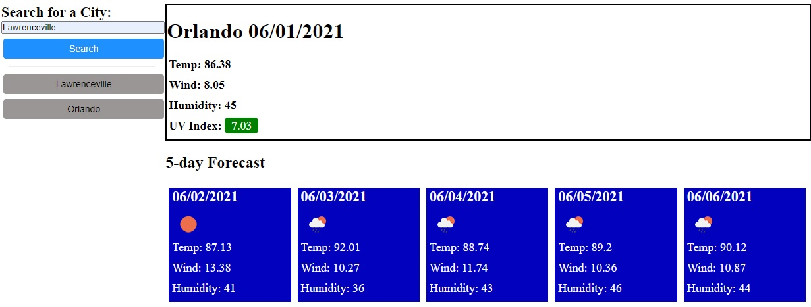

# weatherDashboard
Project #2 weather dashboard: presents the weather of a city

## links  
github repository: https://github.com/fjunior1/weatherDashboard              
Website: https://fjunior1.github.io/weatherDashboard/  

## Description
This website starts and the user selects or types a city  
to get weather and forecast info.  

The application saves a list of the latest searched cities and sets them in buttons in the search are to select.    

## Pictures

